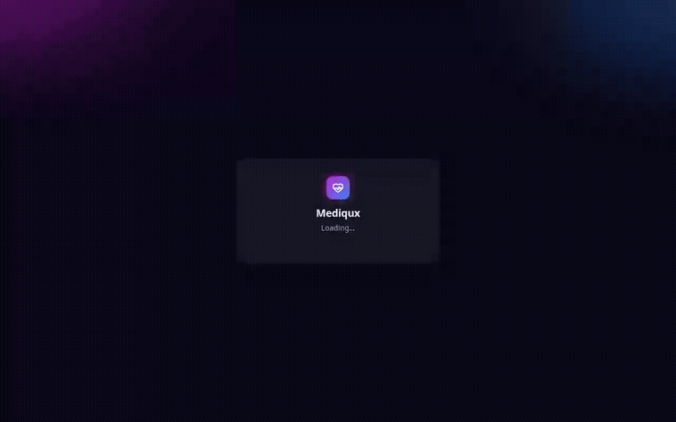
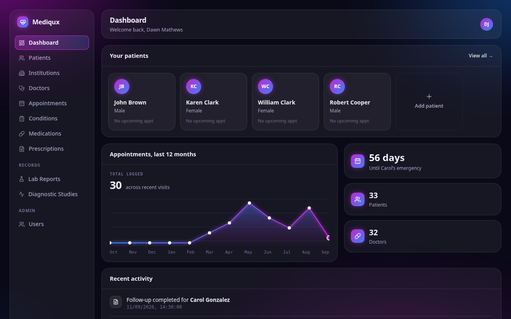
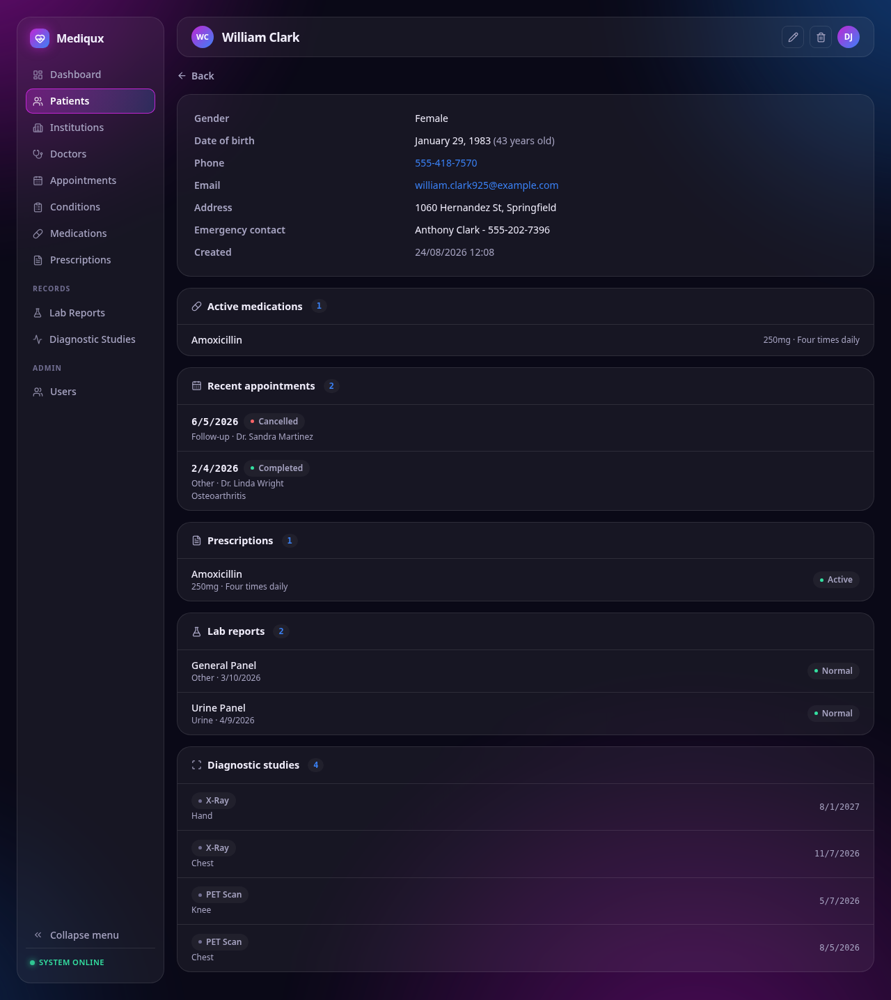
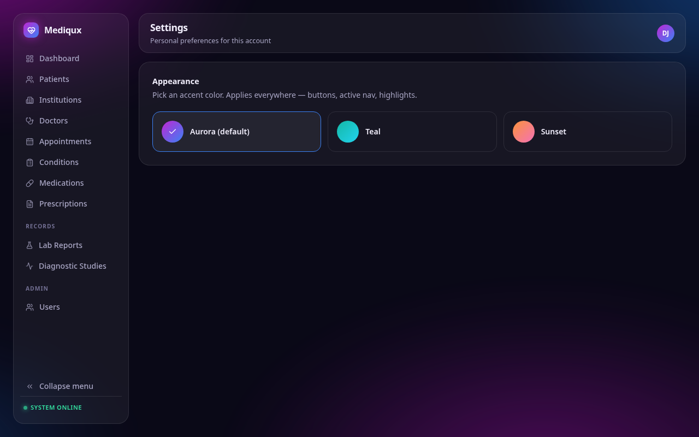

# Screenshots

Logging in, the dashboard, and a patient's detail page (with appointments, prescriptions, and lab reports aggregated in one place).

## A closer look

**Dashboard**

**Patient detail**

**Settings**

---

[← Back to README](README.md)
