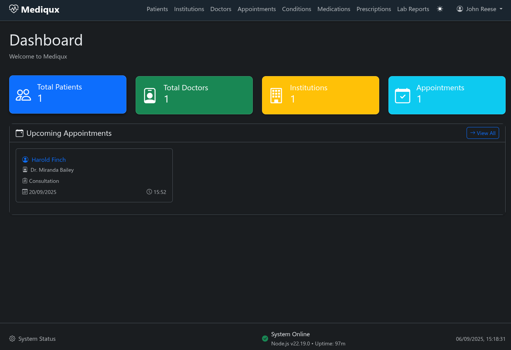

# 📸 Mediqux Screenshots

This page showcases the complete user interface of Mediqux Medical Management System. All screenshots demonstrate the application's clean, healthcare-focused design and comprehensive feature set.

---

## 🏠 Dashboard

**Main Dashboard - System Overview**

The main dashboard provides a comprehensive overview of system health, recent activities, and quick access to all major features. Key components include system status indicators, recent patient activities, and navigation to all modules.

---

## 🔐 Authentication

**Login Page**

Secure login interface with JWT-based authentication. The system supports role-based access control with admin and user roles, ensuring appropriate data access based on user permissions.

---

## 👥 Patient Management

**Patient Records**

Comprehensive patient management system featuring:
- Complete demographic information
- Contact details and emergency contacts
- Advanced search and filtering capabilities
- Role-based data access controls

---

## 🏥 Institution Management

**Medical Institutions**

Manage healthcare facilities including:
- Hospitals, clinics, and laboratories
- Contact information and addresses
- Institution-doctor relationships
- Comprehensive facility profiles

---

## 👨‍⚕️ Doctor Management

**Healthcare Providers**

Doctor management system with:
- Healthcare provider profiles
- Specializations and credentials
- License tracking
- Institution affiliations

---

## 📅 Appointment System

**Appointment Scheduling**

Advanced appointment management featuring:
- Patient visit scheduling
- Multiple visit types (Consultation, Follow-up, Emergency, Surgery, Therapy)
- Status tracking (Scheduled, Confirmed, In-Progress, Completed, Cancelled)
- Detailed visit documentation

---

## 🏷️ Medical Conditions

**Condition Catalog**

Comprehensive medical conditions management:
- Disease catalog with ICD code support
- Organized by medical specialty and system
- Severity level classification (Low, Medium, High, Critical)
- Usage tracking across prescriptions

---

## 💊 Medication Management

**Drug Database**

Extensive medication management system:
- Comprehensive drug database with JSONB active ingredients
- Dosage forms, strengths, and manufacturer information
- Smart search by name, generic name, or active ingredients
- Advanced medication data storage

---

## 📋 Prescription System

**Prescription Management**

Complete prescription management featuring:
- Link medications to appointments and patient visits
- Patient medication history tracking
- Current and past medications with status
- Comprehensive prescription workflows

---

## 🧪 Lab Reports

**Laboratory Management**

Advanced lab report system with:
- PDF upload and local processing
- Basic pattern recognition for common lab panels (CBC, CMP, BMP, Lipid, LFT, KFT, Thyroid)
- Manual lab value entry with test templates
- Structured lab values with reference ranges
- Descriptive PDF filenames and secure storage

> **Note**: PDF text extraction uses basic pattern matching and is not perfect. Extracted values should always be verified against the original document.

---

## 👤 User Management

**System Administration**

User management and system administration:
- User account creation and management
- Role-based access control (Admin/User roles)
- Patient data filtering for non-admin users
- Comprehensive user profile management

---

## 🎨 Design Features

### Dark/Light Theme Support
All pages support both dark and light themes with persistent user preferences.

### Responsive Design
Mobile-friendly Bootstrap 5 interface that works across all device sizes.

### Healthcare-Focused UI
Clean, professional interface designed specifically for healthcare environments with intuitive navigation and workflow-optimized layouts.

### Consistent Navigation
Unified navigation bar across all pages with proper active states and role-based menu visibility.

---

## 🔒 Privacy & Security

All screenshots demonstrate the application's commitment to:
- **Local-only operation** - No external dependencies
- **Role-based access** - Appropriate data filtering
- **Professional healthcare UI** - HIPAA-conscious design
- **Secure authentication** - JWT-based login system

---

**[← Back to README](README.md)**

---

*Screenshots show the application in development mode. Production deployments maintain the same interface with enhanced security configurations.*